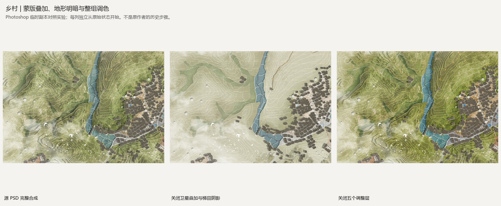
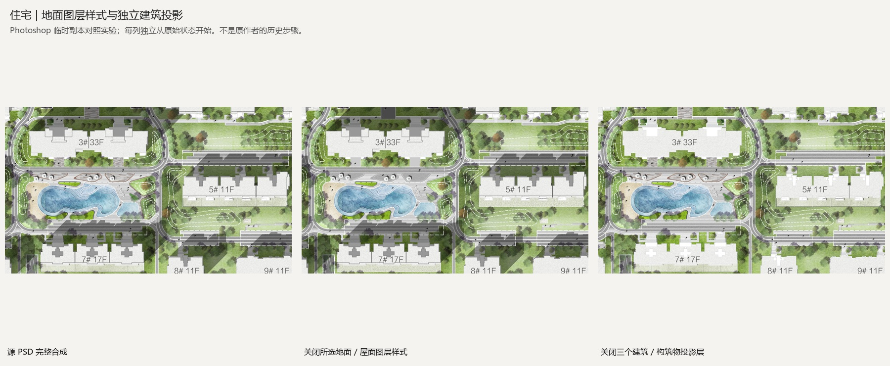
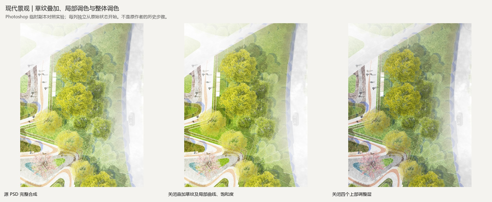
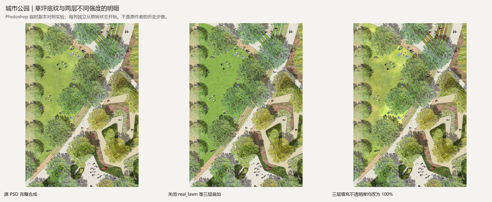

# 四套 PSD 分层工艺拆解

复核日期：2026-09-08。重新读取四个源 PSD 的 439 个图层及组，并在 Photoshop 25.0 的临时副本中逐项关闭图层、样式或改变填充不透明度，比较其实际贡献。源文件哈希与登记一致。

彩平素材是合成过程的输入。完成画面还取决于底层颜色、纹理叠加、局部明暗、边缘处理、对象前后关系、投影、线稿和调色。今后的调用单位应是“空间部位的完整处理配方”。

本次记录三类依据：**源文件事实**是可读取的图层和参数；**视觉观察**来自原合成、单层像素及 Photoshop 对照；**迁移方法**是为新图建立的操作建议。PSD 的保存堆叠顺序不等于作者的历史操作顺序；已经合并进像素的笔刷、滤镜和调色不能反推出确切动作。

完整事实见 [composition-audit.json](../library/composition-audit.json)。下文的 `[索引] / ID` 均为 psd-tools 从底到顶的索引及源 layer_id；住宅图不能依同名图层定位。

## 1. 乡村：分区基底、柔化蒙版、地形叠加和整体气氛

源文件：`美丽乡村规划总平面图.psd`。145 个图层及组；16 个可见剪贴层、18 个带蒙版的可见层、5 个可见调整层。

| 部位 | 源文件事实 | 对画面的作用与迁移方法 |
| --- | --- | --- |
| 草地 / 梯田 | `[1,3] / 35` 梯田基底附内阴影；`[1,4] / 43` 是剪贴纹理且蒙版灰度 152–255。其余五组草地也是基底与剪贴纹理配对，蒙版含中间灰 | 基底控制形状，纹理蒙版控制局部显露强度。新图先按自身边界建底，再分别控制纹理显露和大块明暗，不能只做一个硬边裁切蒙版 |
| 山地整体 | `[3] / 23` 卫星层：叠加 60%；`[4] / 126`：叠加约 30.2%；`[5] / 198`：叠加并带蒙版；`[13] / 179` 梯田阴影：正片叠底约 65.1% | 对照中关闭这四层后，大范围起伏和林地差异明显减弱。新图用目标地形 / 合法背景证据及自身明暗蒙版实现这种作用；不能搬入原卫星地貌 |
| 水面 | `[1,0] / 68` 水域基底有内阴影 40%；其上 `[1,1] / 532` 水波为柔光约 30.2%，剪贴到 ID 68 | 水色、水波和岸内暗边分开。P-W01 的 PNG 不包含下方水域内阴影，贴水波仍需补岸线关系 |
| 铺装 | `[2,2] / 71` 基底含 6% 图案叠加，上方 `[2,3] / 72` 再剪贴另一纹理并带柔化蒙版 | 同一铺地可由底色、细图案、变化纹理共同形成；每层作用和强度独立，避免同一图案无差别平铺 |
| 木栈道 | `[14] / 416` 基底同时有外投影与内阴影，`[15] / 418` 木纹剪贴其上 | 木纹方向、板缝、边缘厚度和落地投影分别处理；不是放一张木纹即可 |
| 调色 | `[8] / 177` 组内为色彩平衡、照片滤镜、色阶、自然饱和度、亮度对比度；自然饱和度 -36、饱和度 -17，该层不透明度 80% | 关闭此组后颜色更浓、更硬。保留“局部材质校色 → 合成后统一色阶”的两阶段；源参数仅作为对照，不照抄到不同底图 |

## 2. 住宅：像素内的明暗、图层样式与独立建筑投影

源文件：`【i素材管家】居住区彩平图.psd`。74 个图层及组，64 个有效可见；可见图层启用了 9 处图案叠加、4 处内阴影、7 处颜色叠加、7 处投影、4 处描边。

| 部位 | 源文件事实 | 对画面的作用与迁移方法 |
| --- | --- | --- |
| 草坪 | `[18] / 132`、`[19] / 158` 都是正片叠底，附内阴影 86%、距离 3 px、柔化 5 px。单层像素中已经可见亮心与暗部过渡 | 草坪层次一部分已画进像素，一部分来自边缘样式。裁一个纹理小样会失去原大面积明暗组织，目标图必须重新建立连续亮暗面；不把像素内渐变冒称仍可编辑的调整层 |
| 地被 | `[12] / 19` 为独立绿化细部，带图案叠加 70% 和投影 75%；`[29] / 162` 是另一组亮绿地被 | 低层植被、乔木和草地分别塑造边缘；局部地被不是重复铺满的第二层草坪 |
| 铺装 | `[22] / 159` 图案叠加 85%、比例 50%；`[24] / 140` 内阴影 75%，另有 5% 正片叠底暖色叠加 | 灰地的小颗粒和米白铺地的暖调、压边来自样式。原 PNG 没烘焙这些效果；必须携带样式资源或在目标边界中重建 |
| 屋面与构件 | `[7] / 21` 带图案叠加和内阴影；`[23] / 146`、`[32] / 145` 等以颜色叠加统一构件色；`[47] / 47` 是屋面像素 | 保持屋面底色、细部、边缘与建筑体量的主次，目标 CAD 决定新建筑几何 |
| 树冠 | `[39–43] / 34,32,36,33,35` 采用约 50%–80% 不透明度，投影距离 27–71 px 不等 | 冠层与投影分别控制；这些源像素距离不能直接当工程高度，迁移时根据本图比例统一光向并区分对象层次 |
| 建筑投影 | `[45] / 39`、`[46] / 49`、`[48] / 54` 是约 50.2% 正片叠底的独立投影层 | 对照中关闭后建筑体量明显变平。不能用所有对象同一套小树影代替建筑、构件、树木各自的投影关系 |

本文件没有独立的可见调整层或蒙版层，不代表没有做过调色、擦除或局部明暗。许多处理已经存入像素 / alpha，另一些依赖图层样式。新成果可以用更易修改的分层方式表达。

## 3. 现代景观：同一草地基底上的多层剪贴与两级调色

源文件：`现代景观彩平图_彩总ID_1178702543.psd`。48 个图层及组，46 个有效可见；5 个可见剪贴层、6 个可见调整层。

| 顺序 / 部位 | 源文件事实 | 迁移方法 |
| --- | --- | --- |
| 草地形状 | `[1] / 18` 图层 2 是草地基底 | 目标闭合绿地控制形状和原始大块明暗 |
| 第一层草纹 | `[2] / 288` 图层 36，普通模式，剪贴到 ID 18 | M-G01 提供细肌理；按目标纹理比例处理 |
| 第二层草纹 | `[3] / 289` 图层 37，叠加模式；整体不透明度 100%，**填充不透明度约 32.9%**，仍剪贴到 ID 18 | M-G02 是同一部位的辅助变化层，保持填充强度，不可用 100% 原像素盖满 |
| 局部调色 | `[4] / 290` 曲线、`[5] / 292` 自然饱和度都剪贴到 ID 18；后者自然饱和度 -33、饱和度 -11 | 草纹两层合成后局部校色，作用域限制在该草地栈。不是最后把全图一起去饱和就能等价 |
| 水景 | `[13] / 55` 水域基底，上方 `[14] / 294` 水面纹理剪贴；喷泉 `[15–16] / 70,71` 另层控制 | 底水色、斑驳纹理、水岸、已有喷泉分工；用新水域形状承载，不搬源水池轮廓 |
| 步道 / 木平台 | 条石 `[8] / 66` 有边界蒙版和描边；木板 `[17] / 63` 也有独立蒙版；浅色路边线 `[11] / 53`、暖色嵌带 `[12] / 54` 独立存在 | 肌理、铺设方向、收边和嵌带分层绘制，既有几何以目标图为准 |
| 上部调色 | `[43] / 297` 色阶，`[44] / 298` 亮度对比度，`[45] / 299` 自然饱和度；`[47] / 302` 色彩平衡另有非均匀蒙版 | 部位处理后再统一柔亮程度与冷暖；保留蒙版选择性，不能把全部图层统一漂白 |

部分树 / 人物层保留了**关闭的投影样式**，另一些有开启的投影。读取效果时必须同时读取总开关和该效果开关。树层也存在填充不透明度与整体不透明度不同的情况；填充控制像素，整体不透明度还影响样式，两者不能简单互换。

## 4. 城市公园：底纹、两层草地明暗、花境基底与设施细节

源文件：`现代公园彩平图_公园彩平图_简约风ID_1202507415.psd`。172 个图层及组，164 个有效可见。没有独立调整层和蒙版层；许多形状、擦除、明暗已落在像素及 alpha 中。

| 部位 | 源文件事实 | 迁移方法 |
| --- | --- | --- |
| 主草坪 | `[1] / 12` lawn 底纹；`[4] / 34` real_lawn 填充约 **65.1%**；`[5] / 331` real_lawn2 填充约 **22.0%**，三者主草坪覆盖范围一致 | 底纹上再用两层不同强度的明暗像素组织变化。新图按自身草坪形状建立大块亮暗，不能把 U-G02 当唯一草地底色 |
| 台阶绿带 | `[6] / 36` lawn_step 与 `[7] / 37` real_lawn2 分开；后者填充约 31.0% | 台阶形状与表面变化分工，尺度和收边单独检查 |
| 路面与碎石 | `[17] / 23` pave_path 填充约 45.1%；`[14] / 29` gravel 用叠加模式、填充约 32.2%；`[15] / 31` gravel_shadow 独立存在 | 轻铺装和窄碎石带依赖底层颜色及强度控制，再补接触关系，不能直接用原 PNG 的满强度 |
| 岩石花园 | `[33] / 69` 溶解约 25.1% + 图案；`[34] / 68` 普通约 49.0% + 另一图案；`[35] / 70` 叠加、填充约 41.2% | 颗粒、粗细材质、颜色变化分层叠加。溶解模式只在这种颗粒节点按效果选用，不泛用于所有草地 |
| 花境 | `[54] / 60` 与 `[55] / 57` 各含图案叠加；其上 `[56] / 54` flower_all、`[57] / 55` flower、`[58] / 50` groundcover 分开 | 素材 U-B01–03 仅覆盖其中部分像素。目标花境需要深色底层、粗细植被、局部花色、边缘和接触暗部共同组织 |
| 树群 | grove 组 `[66] / 184` 的组不透明度约 78.8%；街树填充约 58.8%–70.2%，大树存在不同填充与树影距离 | 同时管理父组、单层、填充和样式，保持前后疏密、大小、透明度差异；不能只复制单树 PNG |
| 水 / 设施 / 活动 | water、Layer 15（水面明度模式约 58.0%）、bench、seatwall、people、arts_shadow、桥墙和桥阶独立成层 | 节点有地面、边界、家具、活动及对应投影。树影与坐凳、挡墙、桥的接触影尺度不同；配置服从本次方案实际功能 |

对照中关闭主草坪两层明暗及台阶绿带辅助层后，草地更均匀；把这三层填充都改成 100% 后，高亮斑块和颜色过强。增加层次需要控制作用域、比例和合成强度。

## 5. 今后执行方式

按 [material-workflows.json](material-workflows.json) 为每个目标部位建立操作清单，落实“底色与几何 → 肌理 → 局部明暗 / 校色 → 边缘和接触 → 配景与投影 → 合成统一”。顺序按遮挡、剪贴与样式依赖调整。每项记录目标图层 / 蒙版、参数和完成状态；不适用项说明空间原因，不为凑图层增加无关效果。

树群的大小与疏密、草坪宏观深浅仍执行 [构图参数](visual-composition.json)。图层多不能自动证明丰富；完成局部试铺后，需要开关对照和最终缩略图共同验证。

本次还登记了 15 个被图层效果引用的嵌入图案资源，包括当前隐藏层所引用的资源。它们不是 15 张新增获准投放的 PNG。使用样式时需要连同真实图案资源转移并核对效果，不能只保存图案名称 / UUID。清点见完整事实文件的 `patterns`。
